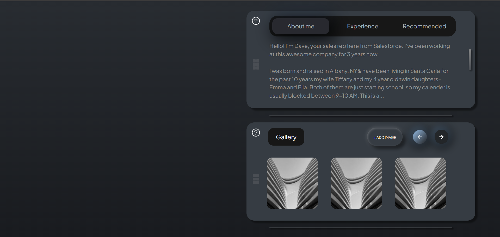

# Assessment

A responsive desktop.

[Live Demo]()

## ✨ Features
- Responsive two-widget layout (for laptop screens)
- Tab system with transitions ("About Me", "Experiences", "Recommended")
- Image gallery with **Add Image** functionality
- Accurate padding, shadows, hover effects from Figma
- Smooth animations and pixel-consistent alignment

## 🛠️ Tech Stack

- **Framework**: React.js
- **Styling**: Tailwind CSS
- **Icons**: React-icons
- **Deployment**: Vercel
- **Version Control**: Git & GitHub

## 🚀 Getting Started

1. Clone the repository
2. Install dependencies: `npm install`
3. Run development server: `npm run dev`
4. Open localhost link
